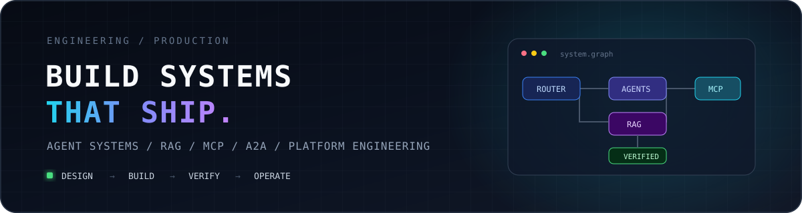

<div align="center">
  

  <br />

  
  
  
</div>

## Featured Systems

<table>
  <tr>
    <td width="50%" valign="top">
      <h3><a href="https://github.com/gxc02529-jpg/shopagent-pro">ShopAgent Pro</a></h3>
      <p>全渠道电商多智能体客服中台。商品、推荐、订单与售后领域隔离，生产主链路真实跨越 A2A 与 MCP，包含反馈审核、知识发布和后续复用闭环。</p>
      <p><code>FastAPI</code> <code>Multi-Agent</code> <code>MCP</code> <code>A2A</code> <code>Redis</code> <code>MySQL</code></p>
      <a href="https://github.com/gxc02529-jpg/shopagent-pro/actions/workflows/ci.yml"></a>
      <a href="https://github.com/gxc02529-jpg/shopagent-pro/releases"></a>
    </td>
    <td width="50%" valign="top">
      <h3><a href="https://github.com/gxc02529-jpg/enterprise-sales-agent">Enterprise Sales Agent</a></h3>
      <p>企业销售分析 Agent。围绕状态编排、工具协议、检索增强与知识关系构建可验证的数据分析链路，公开演示数据已脱敏。</p>
      <p><code>LangGraph</code> <code>FastMCP</code> <code>RAG</code> <code>Knowledge Graph</code></p>
      <a href="https://github.com/gxc02529-jpg/enterprise-sales-agent/actions/workflows/ci.yml"></a>
    </td>
  </tr>
  <tr>
    <td width="50%" valign="top">
      <h3><a href="https://github.com/gxc02529-jpg/CaseOps">CaseOps</a></h3>
      <p>SaaS 技术支持工单编排。通过 LangGraph 条件路由、混合检索、引用白名单、人工审批与知识回流控制自动化边界。</p>
      <p><code>LangGraph</code> <code>Hybrid Retrieval</code> <code>Approval Gates</code> <code>FastAPI</code></p>
      <a href="https://github.com/gxc02529-jpg/CaseOps/actions/workflows/ci.yml"></a>
      <a href="https://github.com/gxc02529-jpg/CaseOps/releases"></a>
    </td>
    <td width="50%" valign="top">
      <h3><a href="https://github.com/gxc02529-jpg/KnowLoop">KnowLoop</a></h3>
      <p>物流售后知识问答。覆盖 FAQ 直出、Dense + BM25 多路召回、重排与引用，以及租户范围和知识版本治理。</p>
      <p><code>RAG</code> <code>Dense + BM25</code> <code>Reranking</code> <code>Knowledge Governance</code></p>
      <a href="https://github.com/gxc02529-jpg/KnowLoop/actions/workflows/ci.yml"></a>
      <a href="https://github.com/gxc02529-jpg/KnowLoop/releases"></a>
    </td>
  </tr>
  <tr>
    <td colspan="2" valign="top">
      <h3><a href="https://github.com/gxc02529-jpg/HireAgent">HireAgent</a></h3>
      <p>招聘协作 Agent。13 个工具调用、3 个职责受限 Agent 与 9 类结构化意图，通过 FastMCP 和 FastAPI 提供可解释匹配与幂等排期。</p>
      <p><code>FastMCP</code> <code>Scoped Agents</code> <code>Structured Intent</code> <code>Idempotency</code></p>
      <a href="https://github.com/gxc02529-jpg/HireAgent/actions/workflows/ci.yml"></a>
      <a href="https://github.com/gxc02529-jpg/HireAgent/releases"></a>
    </td>
  </tr>
</table>

## System Design

```text
Client / Channel
       │
       ▼
API Gateway ── Identity · Rate Limit · Trace · Streaming
       │
       ▼
Orchestrator ── Intent · State · Routing · Approval · Fallback
       │
       ├── Domain Agents ── Product · Order · Support · Analytics
       │         │
       │         └── MCP Tools ── Schema · Auth · Timeout · Circuit Breaker
       │
       └── Knowledge ── Hybrid Recall · Rerank · Citation · Versioning
                 │
                 ▼
Data & Operations ── Redis · SQL · Vector Store · Audit · Metrics
```

## Engineering Stack

<div align="center">


</div>

## Quality Bar

| Runtime | Verification | Safety | Operations |
|---|---|---|---|
| 本地最小路径可运行 | 单元、协议与端到端测试 | 合成/脱敏公开数据 | Health / Ready / Metrics |
| 明确生产传输边界 | 多 Python 版本 CI | 身份、权限与幂等 | Trace、审计与告警接口 |
| 可插拔模型与存储 | 锁定依赖与镜像构建 | PII 处理与审批门禁 | 降级、熔断与恢复路径 |

<div align="center">
  <sub>Design boundaries. Verify behavior. Ship maintainable systems.</sub>
</div>
